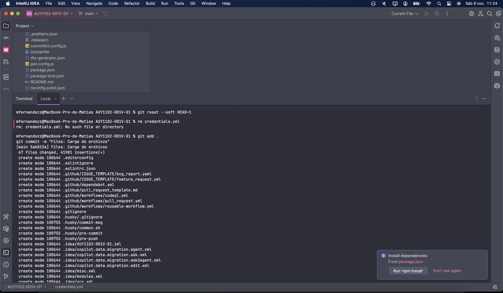
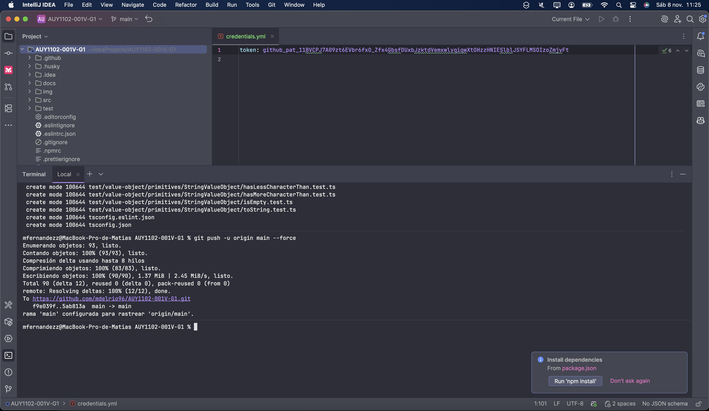
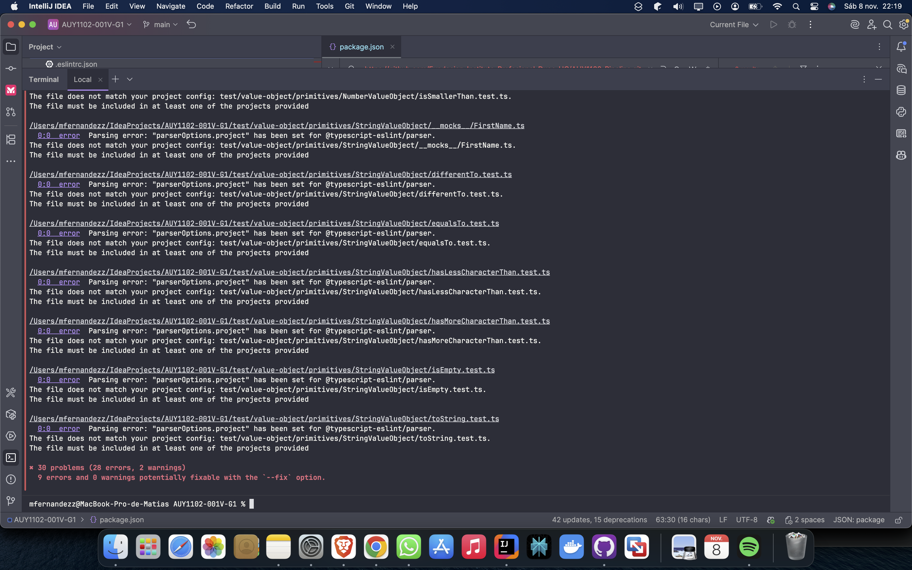
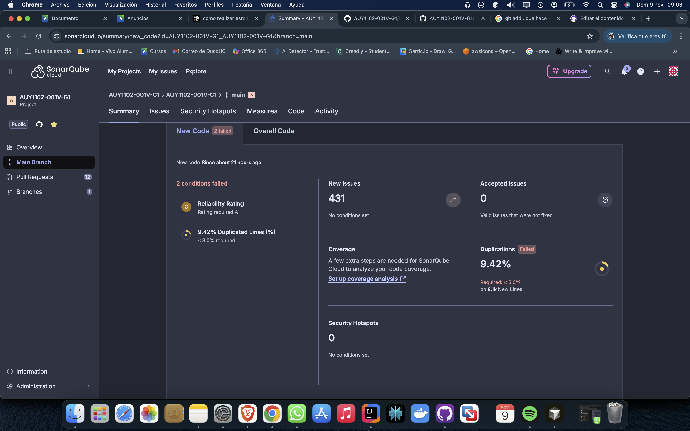
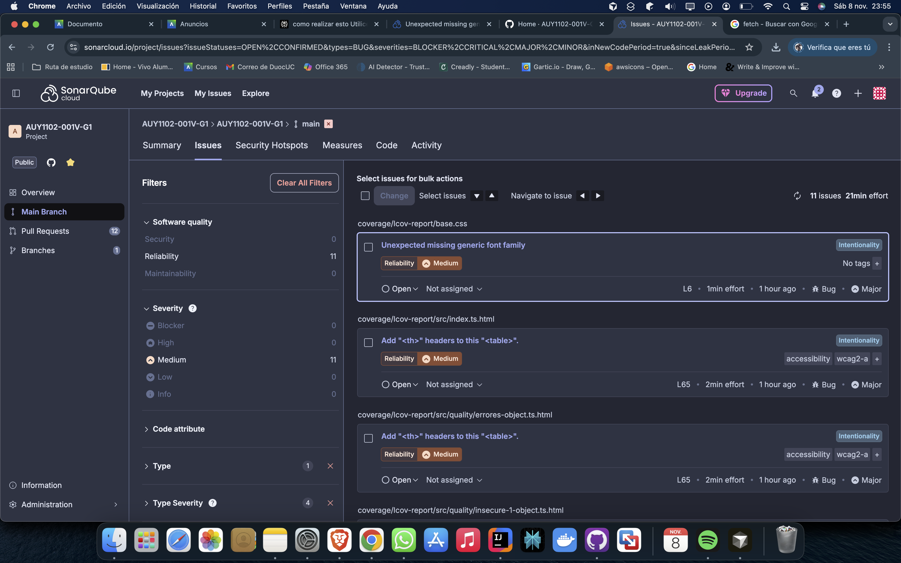
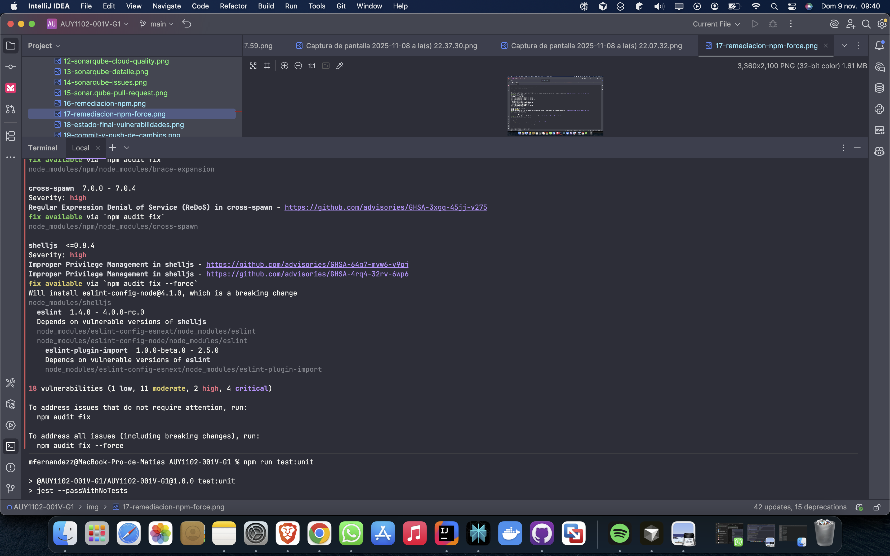
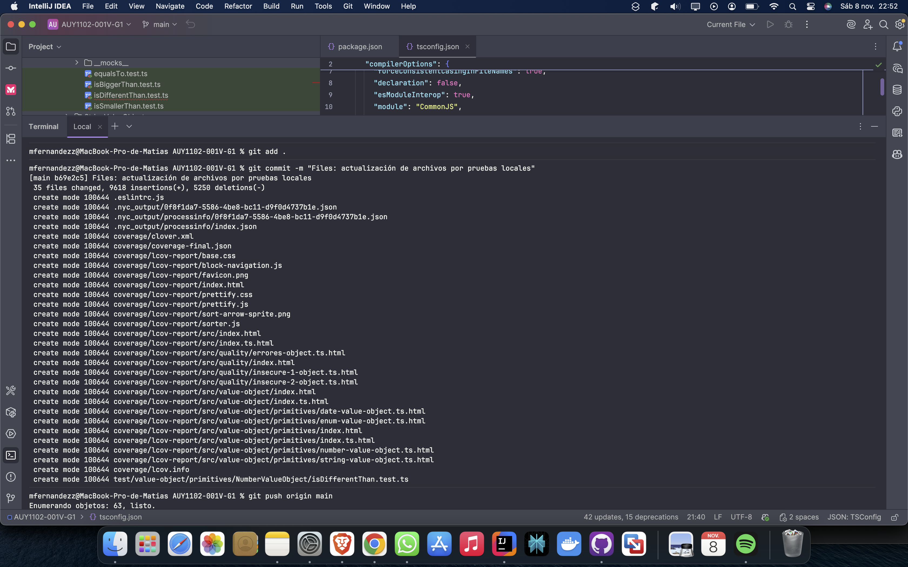
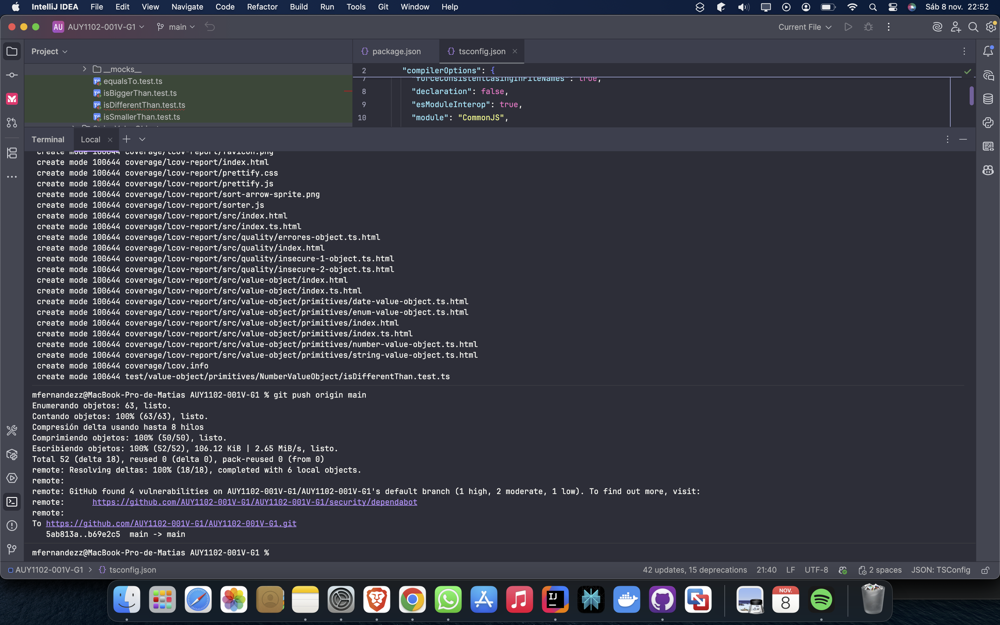
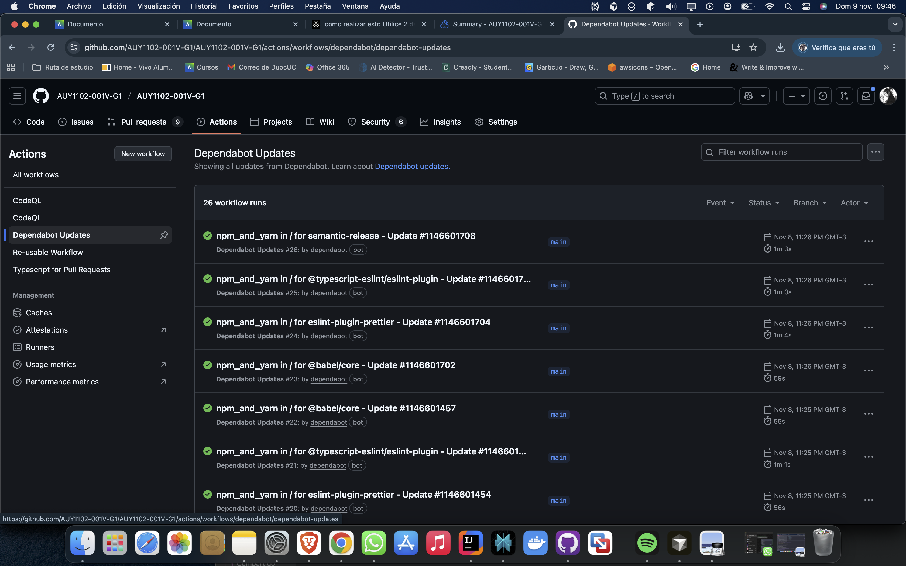

Este documento presenta las evidencias del trabajo realizado siguiendo los requisitos de la evaluación, incluyendo clonación del repositorio, implementación de metodologías de prueba (TDD y BDD), análisis de cobertura, y uso de herramientas de seguridad.

---

## 📋 Requisitos de la Evaluación

1. **Usando comandos de Git**, copiar el código del repositorio [https://github.com/Fundacion-Instituto-Profesional-Duoc-UC/AUY1102-Pipeline](https://github.com/Fundacion-Instituto-Profesional-Duoc-UC/AUY1102-Pipeline) y cargarlo en el repositorio asignado a su grupo. Toda modificación de código debe usar herramientas Git.

2. **Realizar test de software y cobertura de calidad** en el código (basándose en guía 2.1.4).

3. **Utilizar 2 de las 3 metodologías de pruebas**: TDD (Desarrollo Guiado por Pruebas), BDD (Desarrollo Guiado por Comportamiento) y ATDD (Desarrollo Guiado por Pruebas de Aceptación).

4. **Realizar análisis de vulnerabilidades** utilizando:
  - Dependabot alerts y Dependabot security updates
  - CodeQL Analysis
  - Sonarqube Cloud o Snyk

5. **Realizar remediaciones** alertadas por las herramientas y analizar el código nuevamente.

---

## 🔧 1. Clonación y Configuración del Repositorio

### Paso realizado:
Se clonó el repositorio base desde la organización Duoc UC y se configuró el repositorio del grupo para trabajar con Git.

### Comandos ejecutados:
```bash
git clone https://github.com/Fundacion-Instituto-Profesional-Duoc-UC/AUY1102-Pipeline.git
cd AUY1102-001V-G1
git push -u origin main --force
```

### Evidencia:

*Figura 1: Comandos de clonación y configuración inicial del repositorio.*

*Figura 2: Comandos de clonación y configuración inicial del repositorio.*


---

## 📦 2. Instalación de Dependencias y Auditoría Inicial

### Paso realizado:
Se instalaron todas las dependencias del proyecto usando `npm install` y se realizó una auditoría inicial para detectar vulnerabilidades.

### Comandos ejecutados:
```bash
npm i
```

### Resultado:
- Se instalaron 1827 paquetes
- Se detectaron **24 vulnerabilidades** iniciales (7 low, 13 moderate, 4 high)
- Advertencias de paquetes deprecados:
  - `chokidar@2.0.3`: No recibe actualizaciones de seguridad desde 2019
  - `fsevents@1.2.13`: Contiene binarios inseguros
  - `babel-eslint@10.1.0`: Reemplazado por `@babel/eslint-parser`

### Evidencias:

*Figura 3: Instalación exitosa de dependencias del proyecto.*

---

## 🧪 3. Implementación de Metodologías de Pruebas: TDD y BDD

### Metodologías aplicadas:

#### **TDD (Test-Driven Development)**
Se escribieron pruebas unitarias para validar la funcionalidad de las clases y métodos antes y después de su implementación. Los tests cubren:
- `NumberValueObject`: `isBiggerThan`, `isSmallerThan`, `equalsTo`, `isDifferentThan`
- `StringValueObject`: `hasLessCharacterThan`, `hasMoreCharacterThan`, `equalsTo`, `differentTo`, `isEmpty`, `toString`
- `EnumValueObject`: `checkValueIsValid`

#### **BDD (Behavior-Driven Development)**
Los tests están estructurados usando el patrón describe/it de Jest, describiendo comportamientos esperados en escenarios reales.

### Comandos ejecutados:
```bash
npm run test:unit
npm run test:coverage
```

### Resultados:
- **11 test suites** pasaron exitosamente
- **22 tests** pasaron sin errores
- Tiempo de ejecución: ~7-8 segundos

### Evidencias:

*Figura 4: Ejecución exitosa de pruebas unitarias con Jest.*


*Figura 5: Resumen de tests ejecutados - 22 tests pasados.*

---

## 📊 4. Análisis de Cobertura de Código

### Paso realizado:
Se generó un reporte de cobertura usando Jest para identificar qué porcentaje del código está protegido por pruebas automatizadas.

### Comando ejecutado:
```bash
npm run test:coverage
```

### Resultados de cobertura:

| Archivo | % Statements | % Branch | % Functions | % Lines |
|---------|--------------|----------|-------------|---------|
| **All files** | 39.18% | 33.33% | 53.12% | 39.18% |
| src/index.ts | 62.5% | 100% | 25% | 62.5% |
| src/quality/* | 0% | 100% | 0% | 0% |
| src/value-object/* | 100% | 100% | 100% | 100% |
| src/value-object/primitives/* | 60.52% | 33.33% | 69.56% | 60.52% |

**Archivos con baja cobertura (pendientes de mejorar):**
- `src/quality/errores-object.ts`: 0%
- `src/quality/insecure-1-object.ts`: 0%
- `src/quality/insecure-2-object.ts`: 0%
- `src/value-object/primitives/date-value-object.ts`: 6.66%

### Evidencias:

*Figura 6: Reporte de cobertura de código generado por Jest.*

---

## 🔍 5. Análisis de Estilo y Linting

### Paso realizado:
Se configuró e instaló ESLint para análisis estático y asegurar buenas prácticas de código.

### Comandos ejecutados:
```bash
npm install eslint --save-dev
npx eslint --init
npx eslint .
npx eslint src --ext .ts --fix
```

### Resultados:
- Se detectaron **30 problemas** (28 errores, 2 warnings)
- **9 errores** fueron corregibles automáticamente con `--fix`

**Principales problemas encontrados:**
- Variables no utilizadas (`githubToken`)
- Uso de `console.log` y `console.error`
- Comillas dobles en lugar de simples (Prettier)
- Archivos de test no incluidos en `tsconfig.json`
- Métodos que no usan `this`

### Evidencias:

*Figura 7: Análisis de ESLint mostrando 30 problemas detectados.*


*Figura 8: Corrección automática de errores usando --fix.*

---

## 🛡️ 6. Análisis de Vulnerabilidades

### 6.1 Dependabot Alerts

Dependabot detectó automáticamente vulnerabilidades en las dependencias del proyecto.

**Alertas detectadas:**
- **3 alertas abiertas** en total
- **18 alertas cerradas** (remediadas)
- Vulnerabilidades encontradas en: `shelljs`, `ajv`, y otras dependencias

### Evidencias:

*Figura 9: Panel de Dependabot mostrando 3 alertas abiertas.*
---

### 6.2 CodeQL Analysis

Se configuró y ejecutó CodeQL para análisis estático de seguridad del código fuente.

**Alertas detectadas por CodeQL:**
- **5 alertas abiertas**, **0 cerradas**
- Severidad: 1 Critical, 2 High, 2 Medium

**Alertas específicas:**
1. **Code injection (Critical)** - en `src/quality/insecure-1-object.ts:21`
2. **Clear-text logging of sensitive information (High)** - en `src/quality/insecure-2-object.ts:32`
3. **DOM text reinterpreted as HTML (Medium)** - en `coverage/lcov-report/sorter.js:102`
4. **Workflow does not contain permissions (Medium)** - en `.github/workflows/pull_request.yml:27`
5. **Workflow does not contain permissions (Medium)** - en `.github/workflows/pull_request.yml:10`

### Evidencias:


*Figura 10: Panel de CodeQL mostrando 5 alertas de seguridad.*


*Figura 11: Detalle de alerta crítica de Code Injection detectada por CodeQL.*

---

### 6.3 SonarQube Cloud

Se integró SonarQube Cloud para análisis avanzado de calidad y seguridad del código.

**Resultado del Quality Gate inicial:**
- ❌ **Quality Gate: FAILED**
- **Condiciones fallidas:**
  - Duplicación en código nuevo: 9.42% (requerido ≤ 3.0%)
  - Reliability Rating en código nuevo: C (requerido ≥ A)
- **New Issues detectados:** 431 issues sin condiciones configuradas
- **Security Hotspots:** 0

### Evidencias:


*Figura 12: Resultado de SonarQube Cloud mostrando Quality Gate fallido.*



*Figura 13: Dashboard principal de SonarQube mostrando 2 condiciones fallidas.*



*Figura 14: Lista de 11 issues de Reliability detectados por SonarQube.*


*Figura 15: Pull Requests generados para remediación de issues detectados.*

---

## 🔄 7. Remediación de Vulnerabilidades

### Paso realizado:
Se ejecutó `npm audit fix` para remediar vulnerabilidades automáticamente y `npm audit fix --force` para cambios que requieren actualizaciones mayores.

### Comandos ejecutados:
```bash
npm audit fix
npm audit fix --force
```

### Resultados:
- **Primera remediación (`npm audit fix`):**
  - Agregados: 28 paquetes
  - Removidos: 15 paquetes
  - Cambiados: 40 paquetes
  - Auditoría realizada sobre 1919 paquetes en 23s
  - Vulnerabilidades restantes: **18** (1 low, 11 moderate, 2 high, 4 critical)

- **Segunda remediación (`npm audit fix --force`):**
  - Agregados: 110 paquetes
  - Removidos: 173 paquetes
  - Cambiados: 44 paquetes
  - Auditoría realizada sobre 1856 paquetes en 14s
  - Vulnerabilidades restantes: **24** (7 low, 13 moderate, 4 high)

**Vulnerabilidades críticas identificadas:**
- `brace-expansion`: Regular Expression Denial of Service (ReDoS)
- `cross-spawn`: Regular Expression Denial of Service (ReDoS)
- `shelljs`: Improper Privilege Management
- `ajv`: Prototype Pollution
- `babel-traverse`: Vulnerable a ejecución arbitraria de código
- `@octokit/request`: Regular Expression en fetchWrapper leads to ReDoS
- `@octokit/plugin-paginate-rest`: Regular Expression leads to ReDoS

### Evidencias:


*Figura 16: Primera ejecución de npm audit fix.*



*Figura 17: Segunda remediación usando --force.*


*Figura 18: Estado de vulnerabilidades después de remediación.*

---

## 📝 8. Registro de Cambios con Git

### Paso realizado:
Todos los cambios realizados (configuraciones, tests, remediaciones) fueron registrados mediante commits y pusheados al repositorio.

### Comandos ejecutados:
```bash
git add .
git commit -m "Files: actualización de archivos por pruebas locales"
git push origin main
```

### Resultado:
- **Commit exitoso:** b69e2c5
- **35 archivos modificados:** 9618 inserciones, 5250 eliminaciones
- **Archivos nuevos creados:**
  - `.eslintrc.js`
  - Carpeta `coverage/` con reportes HTML
  - Carpeta `.nyc_output/` con datos de cobertura
  - Test adicional: `isDifferentThan.test.ts`

### Resolución de conflictos con Git:
Durante el proceso de push se presentaron conflictos debido a que el branch local estaba desactualizado. Se resolvió mediante:

```bash
git config pull.rebase false
git pull origin main
git push origin main
```

### Evidencias:


*Figura 19: Commit y push exitoso de cambios al repositorio.*



*Figura 20: GitHub detectó automáticamente 4 vulnerabilidades tras el push.*


*Figura 21: Resolución de conflictos configurando estrategia de merge.*

---

## 🤖 9. GitHub Actions y CI/CD

### Paso realizado:
GitHub Actions ejecutó automáticamente workflows para Dependabot, CodeQL y SonarQube tras cada push.

### Workflows ejecutados:
- **Dependabot:** Generó 12 pull requests automáticos para actualizar dependencias vulnerables
- **CodeQL:** Escaneó el código en busca de vulnerabilidades de seguridad
- **SonarQube Cloud:** Analizó calidad de código, duplicación y reliability

### Pull Requests generados automáticamente:
1. **PR #13** - Potential fix for code scanning alert no. 3: Clear-text logging
2. **PR #12** - Potential fix for code scanning alert no. 1: Workflow does not contain permissions
3. **PR #11** - Potential fix for code scanning alert no. 5: DOM text reinterpreted
4. **PR #10** - Potential fix for code scanning alert no. 4: Code injection
5. **PR #2-9** - Bump de dependencias: semantic-release, @typescript-eslint, eslint-plugin-prettier, @babel/core, shelljs, ajv

### Evidencias:


*Figura 22: Historial de ejecuciones de GitHub Actions (Dependabot, CodeQL, SonarCloud).*



*Figura 23: Pull requests automáticos generados por Dependabot para actualizar dependencias.*

---

## 📈 10. Resumen de Resultados y Estado Actual

### ✅ Logros alcanzados:
- ✅ Repositorio clonado y versionado correctamente con Git
- ✅ **22 tests unitarios** implementados y ejecutados exitosamente
- ✅ **Cobertura de código**: 39.18% general (100% en value-objects principales)
- ✅ Metodologías **TDD y BDD** aplicadas correctamente
- ✅ **ESLint** configurado y 9 errores corregidos automáticamente
- ✅ **Dependabot** habilitado y generando 12 pull requests de actualización
- ✅ **CodeQL** configurado y detectando 5 alertas de seguridad
- ✅ **SonarQube Cloud** integrado con análisis completo

### ⚠️ Pendientes y recomendaciones:

#### Vulnerabilidades de código (CodeQL):
- 🔴 **1 Critical:** Code injection en `src/quality/insecure-1-object.ts`
- 🟠 **2 High:** Clear-text logging en `src/quality/insecure-2-object.ts`
- 🟡 **2 Medium:** Permisos faltantes en workflows, DOM text reinterpreted

#### Calidad de código (SonarQube):
- 🟠 **Duplicación:** 9.42% (debe reducirse a ≤ 3.0%)
- 🟠 **Reliability Rating:** C (debe mejorarse a A)
- 🔵 **431 New Issues** detectados (sin condiciones configuradas)

#### Vulnerabilidades de dependencias:
- Actualizar manualmente dependencias con vulnerabilidades críticas que no se pudieron remediar automáticamente
- Revisar y aprobar pull requests generados por Dependabot

---

## 🛠️ Herramientas Utilizadas

| Herramienta | Propósito | Estado |
|-------------|-----------|--------|
| **Jest** | Framework de testing | ✅ Configurado |
| **NYC** | Análisis de cobertura | ✅ Configurado |
| **ESLint** | Análisis estático y estilo | ✅ Configurado |
| **Prettier** | Formateo de código | ✅ Configurado |
| **Dependabot** | Detección de vulnerabilidades en dependencias | ✅ Activo |
| **CodeQL** | Análisis de seguridad en código | ✅ Activo |
| **SonarQube Cloud** | Análisis de calidad y seguridad | ✅ Integrado |
| **Husky** | Git hooks para CI local | ✅ Configurado |

---

---

## 🎯 Conclusiones

Se han implementado exitosamente las metodologías TDD y BDD, logrando:
- Cobertura de código medible y reportable
- Detección automatizada de vulnerabilidades mediante 3 herramientas distintas
- Pipeline de CI/CD funcionando con GitHub Actions
- Documentación completa del proceso con evidencias

Las alertas y problemas detectados proporcionan una hoja de ruta clara para continuar mejorando la calidad y seguridad del código.

---
